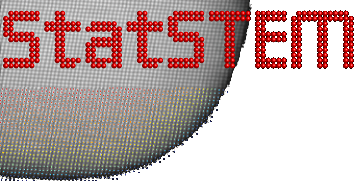

QEM - Quantitative Electron Microscopy
=======================================

Welcome to QEM (Quantitative Electron Microscopy), a comprehensive Python package for analyzing atomic-resolution electron microscopy images. QEM provides robust, fast, and user-friendly tools for quantitative analysis in advanced microscopy.

**Key Features:**

- **Atomic Model Refinement**: Precisely determine scattering cross-sections, atomic positions, and atom counts
- **High-Performance Computing**: GPU acceleration through Keras with multiple backend support
- **Flexible Framework**: Built on Keras with JAX, TensorFlow, and PyTorch backend options
- **Scientific Integration**: Seamless workflow with computational materials modeling via ASE

.. toctree::
   :maxdepth: 2
   :caption: User Guide
   :hidden:

   installation
   quickstart
   tutorials/index
   user_guide/index

.. toctree::
   :maxdepth: 2
   :caption: API Reference
   :hidden:

   api/index
   api/modules

.. toctree::
   :maxdepth: 1
   :caption: Development
   :hidden:

   development/index
   development/contributing
   development/changelog

.. toctree::
   :maxdepth: 1
   :caption: About
   :hidden:

   about/license
   about/citing
   about/contact

Quick Links
-----------

**🚀 Getting Started**
   New to QEM? Start with :doc:`installation` and :doc:`quickstart`

**📚 Tutorials**
   Step-by-step guides at :doc:`tutorials/index`

**🔧 API Reference**
   Complete reference at :doc:`api/index`

**💡 Examples**
   Real-world examples at :doc:`tutorials/basic_analysis`

Installation
------------

Install QEM using pip:

.. code-block:: bash

   pip install qem

Or for development:

.. code-block:: bash

   git clone https://github.com/zezhong-zhang/qem.git
   cd qem
   pip install -e .

Indices and Tables
==================

* :ref:`genindex`
* :ref:`modindex`
* :ref:`search`
